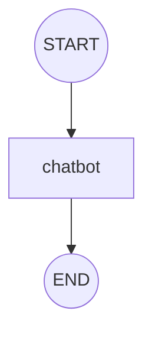

# pilot-langchain-mcp-cli

OpenAI API를 이용한 LangGraph 기반 챗봇 CLI 도구입니다.

## 기능

- **대화형 챗봇**: `my-mcp chat` 명령어로 AI와 대화할 수 있습니다
- **실시간 스트리밍**: 기본적으로 스트리밍 모드로 AI 응답을 실시간으로 출력
- **워크플로우 시각화**: LangGraph 워크플로우를 Mermaid 다이어그램으로 시각화
- **AI 자동 분석**: 워크플로우 구조를 AI가 자동으로 분석하고 설명
- **유닛 테스트**: pytest 기반의 포괄적인 테스트 프레임워크와 LLM 특화 테스트
- **설정 관리**: dynaconf를 사용한 유연한 설정 관리
- **LangGraph 워크플로우**: 구조화된 AI 응답 생성 프로세스
- **Rich UI**: 아름다운 CLI 인터페이스

## 설치 및 설정

### 1. 패키지 설치

```bash
# 개발 환경에서 설치
pip install -e .

# 또는 uv 사용
uv pip install -e .
```

### 2. 설정 파일 생성

```bash
# 설정 파일 템플릿 생성
my-mcp setup

# 또는 수동으로 생성
cp settings.sample.yaml settings.yaml
```

### 3. OpenAI API 키 설정

복사된 `settings.yaml` 파일을 편집하여 OpenAI API 키를 설정합니다:

```yaml
openai:
  api_key: "your-actual-openai-api-key"
  model: "gpt-4o-mini"
  temperature: 0.7
  max_tokens: 1000
  streaming: true  # 스트리밍 모드 (기본값: true)
```

## 사용법

### 챗봇 시작

```bash
# 대화형 챗봇 시작
my-mcp chat

# 일회성 질문 (대화 종료 없이 바로 질문)
my-mcp chat "안녕하세요, 오늘 날씨 어때요?"
my-mcp chat --once

# 스트리밍 비활성화
my-mcp chat --no-stream

# 대화 내용을 마크다운 파일로 저장
my-mcp chat --save
```

#### 챗봇 옵션

- `--once`: 일회성 질문 모드 (대화 종료 없이 질문 후 바로 종료)
- `--no-stream`: 스트리밍 모드 비활성화 (전체 응답을 한 번에 출력)
- `--save`: 대화 내용을 마크다운 파일로 저장

### 대화 종료

대화 중 `/bye`를 입력하면 챗봇이 종료됩니다.

### 그래프 출력 기능

LangGraph 워크플로우를 시각화하고 분석할 수 있는 기능입니다. 워크플로우의 노드와 엣지를 Mermaid 다이어그램 또는 JSON 형식으로 출력할 수 있습니다.

#### 기본 사용법

```bash
# 그래프 구조를 Mermaid 다이어그램으로 출력
my-mcp agent export

# AI 자동 설명 포함
my-mcp agent export --ai-description

# JSON 형식으로 출력
my-mcp agent export --format json
```

#### 사용 예시

```bash
# 기본 그래프 출력 (Mermaid 다이어그램)
my-mcp agent export

# 출력 결과: .my-mcp/diagram.md 파일 생성
```

생성된 마크다운 파일 예시:
```markdown
# LangGraph 워크플로우 다이어그램

## 생성 정보
- 생성일시: 2024-01-20 15:30:45
- 노드 개수: 3개
- 엣지 개수: 2개

## 다이어그램



## AI 분석 및 설명

이 워크플로우는 간단한 챗봇 구조를 나타냅니다...
```

#### 출력 형식

- **Mermaid 다이어그램**: 워크플로우를 시각적으로 표현하는 다이어그램
- **JSON 형식**: 노드와 엣지의 상세 정보를 JSON 형태로 출력
- **AI 설명**: OpenAI API를 통해 워크플로우 구조를 자동 분석하고 설명

#### 저장 위치

- 기본 저장 경로: `.my-mcp/diagram.md`
- 폴더가 없으면 자동 생성
- 마크다운 형식으로 저장되어 GitHub에서 렌더링 가능

### 유닛 테스트

프로젝트의 품질을 보장하기 위한 유닛 테스트 기능을 제공합니다. pytest 기반으로 구성되어 있으며, LLM 특화 테스트도 지원합니다.

#### 테스트 실행

```bash
# 기본 테스트 실행
my-mcp unit-test run

# 특정 마커만 테스트
my-mcp unit-test run --markers "unit"
my-mcp unit-test run --markers "integration"  
my-mcp unit-test run --markers "llm"

# 병렬 테스트 실행
my-mcp unit-test run --parallel

# 상세 출력
my-mcp unit-test run --verbose

# 커버리지 없이 실행
my-mcp unit-test run --no-coverage
```

#### 테스트 환경 구성

```bash
# 테스트 의존성 설치
my-mcp unit-test install

# 테스트 구조 초기화
my-mcp unit-test init

# 테스트 데모 실행
my-mcp unit-test demo
```

#### 테스트 종류

- **Unit Tests**: 개별 함수/클래스의 기능 테스트
- **Integration Tests**: 컴포넌트 간 상호작용 테스트
- **LLM Tests**: LLM 응답 품질 및 일관성 테스트

#### LLM 테스트 기능

- **의미적 유사성 측정**: sentence-transformers 기반
- **문자열 유사성 측정**: rapidfuzz 기반
- **응답 품질 분석**: textstat 기반
- **일관성 테스트**: 반복 실행을 통한 안정성 검증

#### 테스트 결과 보고서

테스트 실행 후 다음 보고서들이 생성됩니다:

- **HTML 보고서**: `reports/pytest_report.html`
- **커버리지 보고서**: `reports/htmlcov/index.html`  
- **JSON 데이터**: `reports/test_results.json`
- **마크다운 요약**: `reports/test_report_YYYYMMDD_HHMMSS.md`

### 기타 명령어

```bash
# 정보 확인
my-mcp info

# 버전 확인
my-mcp version

# 도움말
my-mcp --help
```

## 프로젝트 구조

```
pilot-langgraph-mcp-cli/
├── src/
│   ├── config.py              # 설정 관리 (dynaconf)
│   ├── main.py                # CLI 진입점 및 라우터
│   └── my_mcp/
│       ├── __init__.py
│       ├── logging.py         # 로깅 설정 및 관리 (loguru)
│       └── service.py         # LangGraph 챗봇 서비스
├── settings.sample.yaml       # 설정 템플릿
├── settings.yaml             # 실제 설정 (gitignore)
├── pyproject.toml            # 프로젝트 설정
└── README.md
```

## 개발

### 요구사항

- Python 3.12+
- OpenAI API 키

### 의존성

- `typer`: CLI 프레임워크
- `rich`: 터미널 UI
- `dynaconf`: 설정 관리
- `openai`: OpenAI API 클라이언트
- `langgraph`: LangGraph 워크플로우
- `langchain`: LangChain 프레임워크
- `loguru`: 강력한 로깅 라이브러리

### 로깅 (loguru)

loguru 기반 로깅 설정은 `src/my_mcp/logging.py` 모듈에서 관리하며, `settings.yaml`에서 구성할 수 있습니다:

```yaml
logging:
  level: "INFO"  # DEBUG, INFO, WARNING, ERROR, CRITICAL
  format: "<green>{time:YYYY-MM-DD HH:mm:ss}</green> | <level>{level: <8}</level> | <cyan>{name}</cyan>:<cyan>{function}</cyan>:<cyan>{line}</cyan> - <level>{message}</level>"
  file_enabled: false  # 파일 로깅 활성화 여부
  file_path: "logs/app.log"  # 로그 파일 경로
  rotation: "10 MB"  # 로그 파일 크기 제한
  retention: "10 days"  # 로그 파일 보관 기간
  compression: "zip"  # 로그 파일 압축 방식
  backtrace: true  # 에러 추적 활성화
  diagnose: true  # 상세 진단 정보 포함
```

로그 레벨별 설명:
- `DEBUG`: 상세한 디버깅 정보
- `INFO`: 일반적인 정보 메시지
- `WARNING`: 경고 메시지
- `ERROR`: 오류 메시지
- `CRITICAL`: 치명적인 오류 메시지

로깅 모듈 사용 방법:
```python
# 로깅 모듈 import
from my_mcp.logging import get_logger

# 로거 인스턴스 생성
logger = get_logger("module_name")

# 로그 메시지 출력
logger.info("정보 메시지")
logger.warning("경고 메시지")
logger.error("오류 메시지")
```

### 스트리밍 모드

기본적으로 스트리밍 모드가 활성화되어 AI 응답을 실시간으로 볼 수 있습니다:

```yaml
openai:
  streaming: true  # 스트리밍 활성화
```

스트리밍을 비활성화하려면 `false`로 설정하세요. 비활성화 시 전체 응답을 한 번에 출력합니다.

### 개발 모드

```yaml
development:
  debug: true
  verbose: true
```

## 라이선스

이 프로젝트는 MIT 라이선스 하에 배포됩니다.
